###Problem (Frontend Web)

You and your friends are developing a new start-up called DRUBER, a drone-based ride share application that carries you to your destination. The original specification was to develop a web page that works in 1920x1080 however your company has realized that it is missing an entire market of smartphone users. Describe how you can modify your code to work in smartphone resolutions e.g. 750x1334 (iPhone 8). Please give specific examples where possible, but do not implement an entire DRUBER clone!

BEFORE:

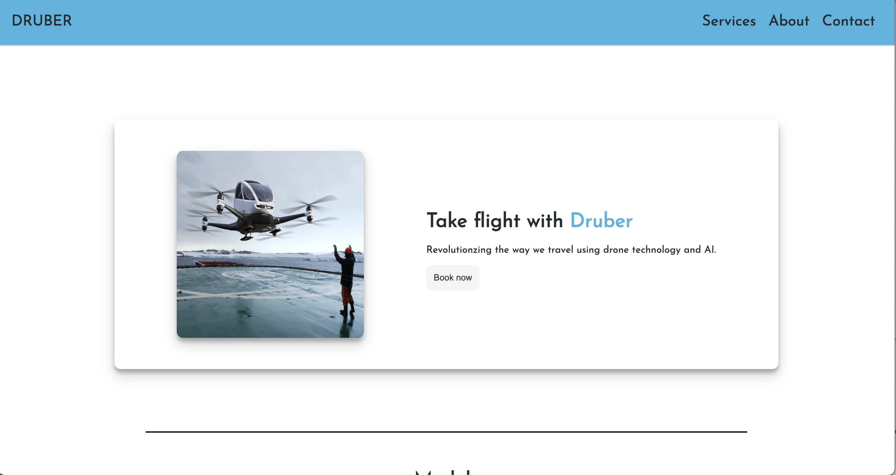
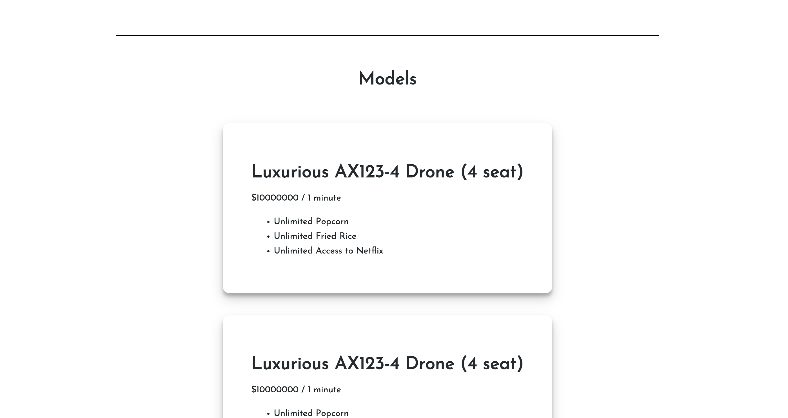

This looks fine doesn't it? Let's try resizing the page.

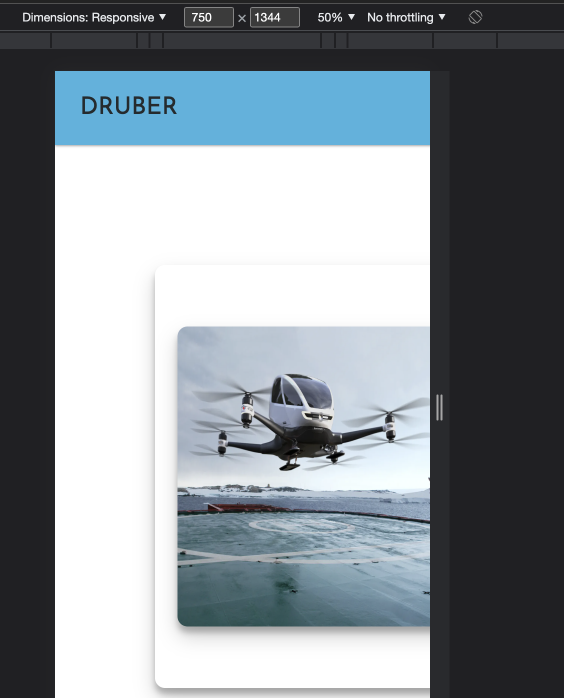
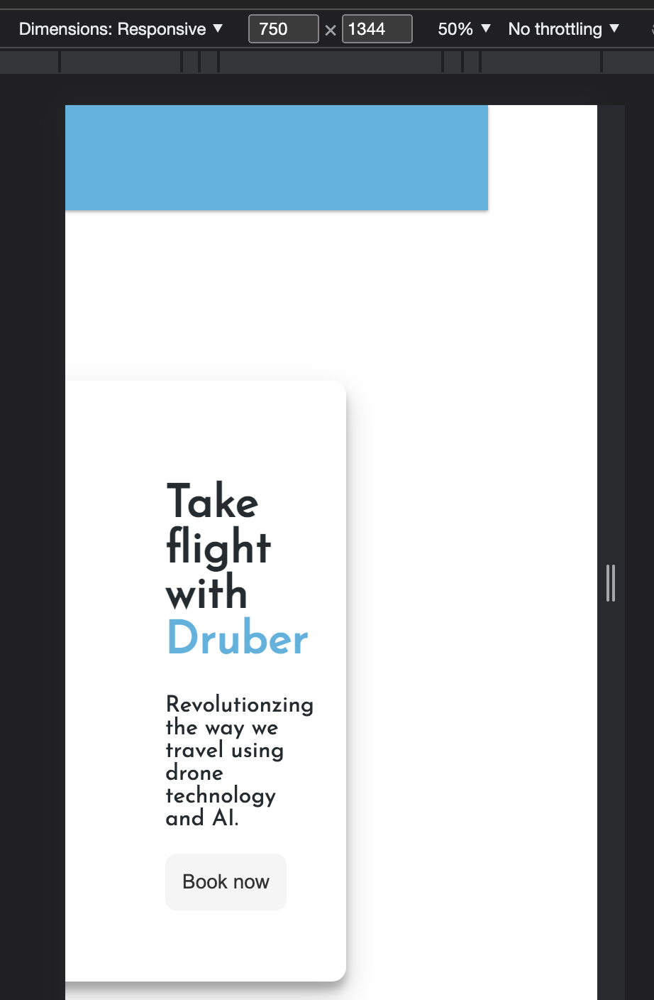
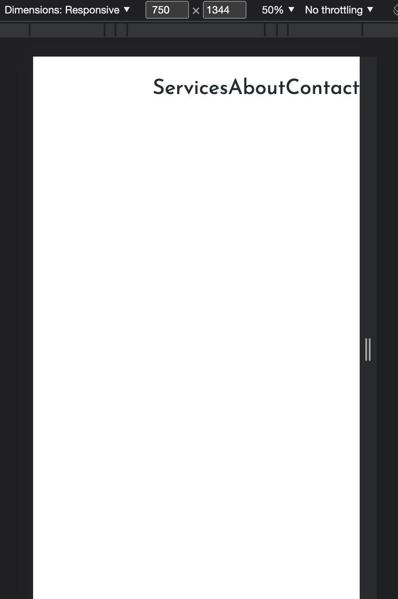
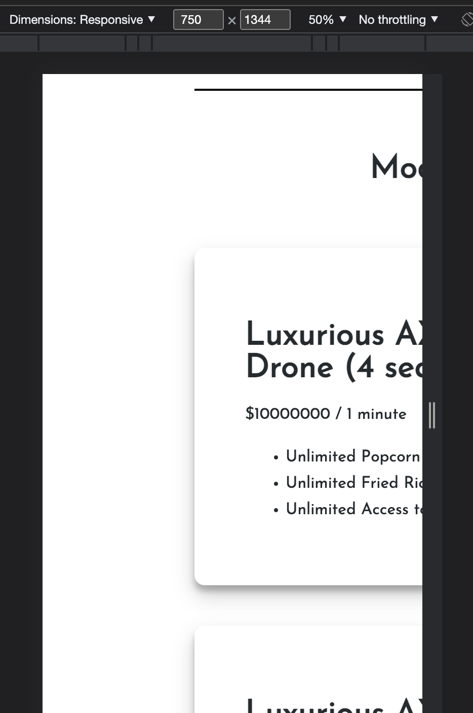
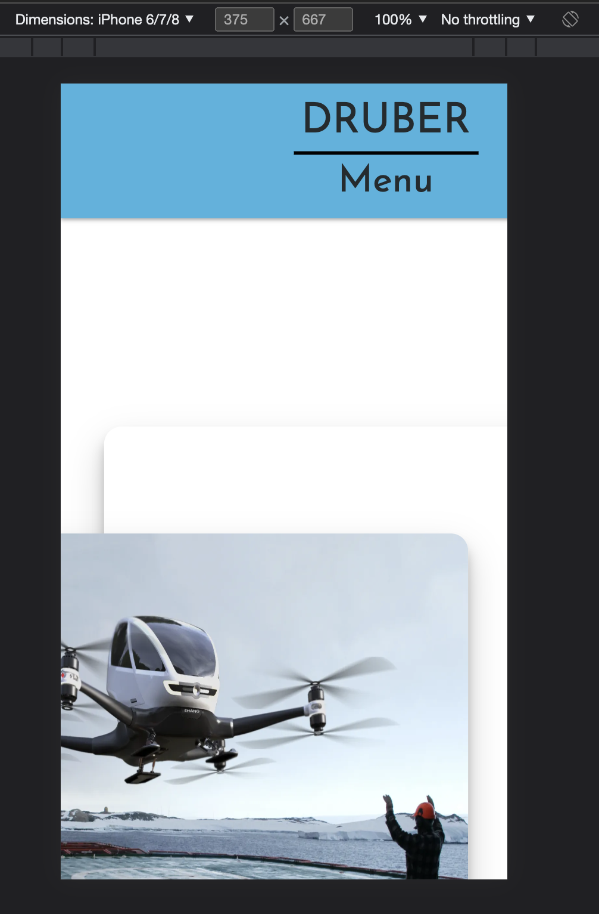

The problem with the implementation before, was that it was not responsive. Images and text would be squished if the window was resized and text wouldn't even show up on the screen because it is off the screen... this is TERRIBLE. If you take a look at the last picture, this is what it would look like on an iPhone 8. You can't even make sense of what's on the screen. DRUBER is clearly doomed... 

Clearly, DRUBER has some really incompetent developers. Mobile users make up over 50% of internet traffic, thus, the mobile experience is crucial to a company's success. Let's take a look at how I would approach this problem.

AFTER: 

Solutions:

1. Media Queries and Flexbox and Conditional Rendering
- Media queries allow us to apply CSS depending on the size of the screen
- Flexbox ensures a very responsive feel to each component of the website. For example, if you resize the window, some elements may grow or shrink at different speeds. This is what flexbox is used for; it's purpose is to map out where components go within your webpage and make them all fit into one container flexibly. 

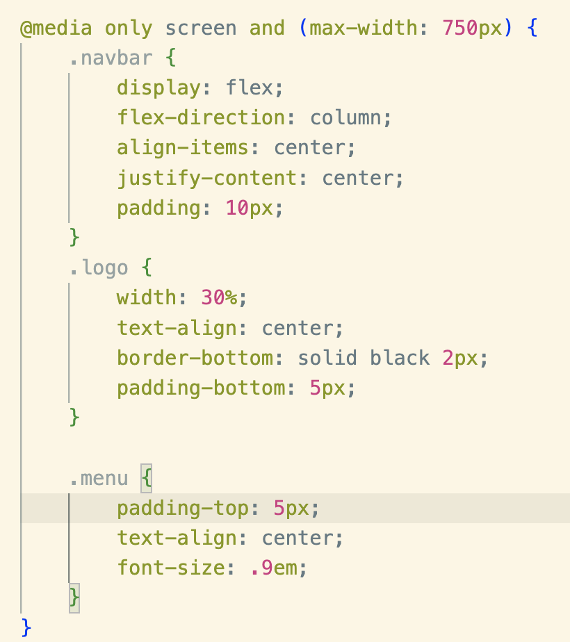

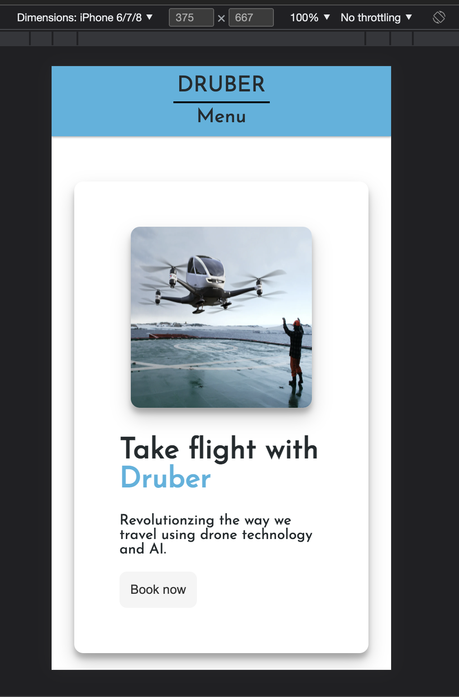

As you can see here, `@media only screen and (max-width: 750px)` specifies that these stylings only apply when the screen is less than 750px wide. Otherwise, your previously defined classes would be the ones applying the styling.

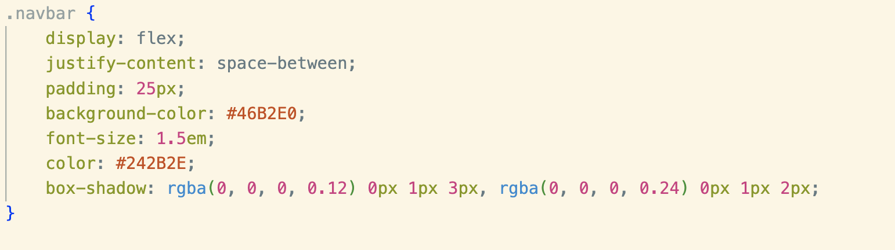

This is an example of flexbox. The navigation bar container is a prime example of where flex box can be used. Normally, the divs containing each of the texts are block level, which means they would be stacked on top of each other. However, we applied flex to it so that now they are able to occupy the same block, and by specifying `justify-content: space-between`, there is a nice gap between our title and our links. 

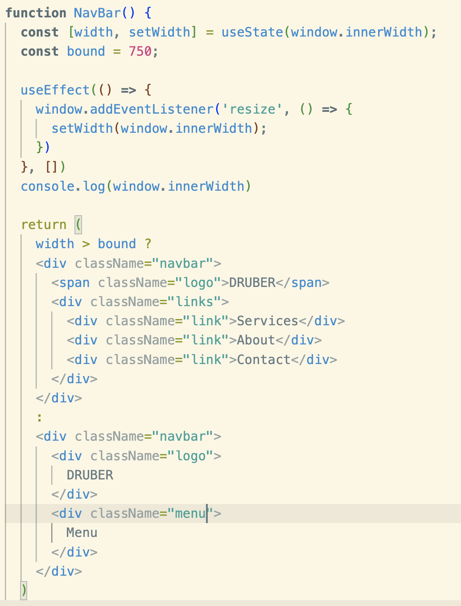

Another key feature that enhances mobile user experience is the fact that window space is used effectively. On a bigger screen size, normally you would see all the links in the navigation bar, but since we're on a phone, we need to optimize our space by hiding all our links in the dropdown called "menu." To do this, we used React's very own conditional rendering. We utilized the useState and useEffect hook to handle our screen width, and depending on the screen width, we're able to render out different components. 

2. Another solution that we could use to implement unique mobile responsive sites is that we could use CSS frameworks/libraries to style our webiste. MUI and TailwindCSS are some very popular resources that many developers use as their pre-built components that are also customizable make styling way easier. I personally like MUI better! :)

Notes: To summarize, this whole ordeal could have been sorted out earlier on if developers focussed on a mobile first approach. It is way easier to scale up rather than scale down as there is more real estate to utilize when you are increasing the screen width and height. 

